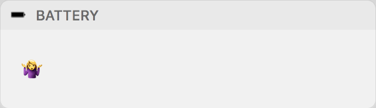

# Battery Widget

A simple Notification Center widget that displays battery information.

The widget has three states:

- Estimated time remaining

- Estimated time until battery is charged

- System is currently estimating either time remaining or time until charge

These numbers are taken from the console output given by `pmset`, with the command: `/usr/bin/pmset -g batt`

You can view the same battery information in the 'Energy' tab of Activity Monitor.

# Install

Download and run the `Battery` application from the release tab.